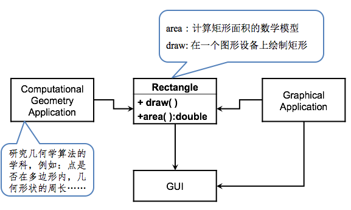
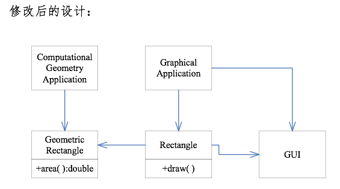
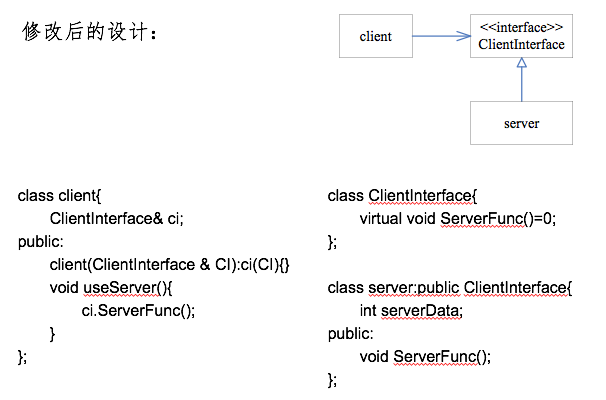
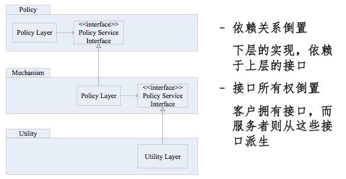

设计原则
===

##0. 写在前面

本项目为研一时《设计模式》课程的总结与扩展，课程教授为北京大学软件工程中心王亚沙教授，参考书为王老师的课件以及四人帮的《设计模式－可复用面向对象软件的基础》。我将在本工程中用C++语言和python语言实现一些常用的设计模式，用于巩固理解和后续查询。

##1. 六个基本设计原则

许多设计模式的本质思想都是遵循这六个基本的设计原则的，所以这里先总结一下这六个基本原则。但是要提下，在某些情况下某些原则是没办法遵守的，这些原则要灵活运用。

1. 单一职责原则（SRP）

    单一职责原则：一个类应该只有一个导致其变化的原因。

        一个职责就是一个独立变化的原因；

        一个类如果承担的职责过多，就等于把这些职责耦合在一起。一个职责的变化可能会虚弱或者抑制这个类完成其他职责。

    例：

    不好1的设计，违背了单一职责原则，一个类同时被两个不相干需求所依赖(计算图形需求和图像应用需求), 这样其中一个需求变动了，可能导致另一个不相干的需求受到影响。
    
    

    修改以后的设计，把两个不相干的职责分离开。

    

2. 开放封闭原则（OCP）

    开放封闭原则：对扩展是开放的，对更改是封闭的。

        对扩展开发：应用需求变化时，可以对模块进行扩展，使其具有满足改变的新行为——即，我们可以改变模块的功能。

        对更改封闭：对模块进行扩展时，不必改动已有的源代码。

    例：

    不好的设计，违背了开放封闭原则。当server更改以后，client作为上层竟然也要跟着更改。

    
    
    修改以后，以接口的形式给出(c++中为纯虚类), 注意，一般定义接口是上层的事，其他程序员根据接口去写实现。接口是抽象的，上层要依赖于抽象而不是依赖于实现。

    

    这里要提一点，尽量把程序设计成封闭的，但是不可能对所有变化都封闭。除非认识到这里可能会有需求更改，否则不要刻意去做封闭，免得画蛇添足。

    敏捷的思想：第一次设计的时候可以按照简单的方法设计，如果出现了需求变化，那么这次修改的时候就把这类需求做封闭。

3. 里氏替换原则（LSP）

    里氏替换原则：派生类对象任何时候都可以替换基类对象。

        基类能够通过的测试，派生类也要能够通过。

    有个很著名的例子“正方形不是矩形”，也就是说正方形不能通过继承矩形来创建，因为存在矩形通过的测试，正方形通不过。

4. 依赖倒置原则（DIP）

    依赖倒置原则: 高层模块不应该依赖于底层模块，二者应该依赖于抽象；抽象不应该依赖于细节，细节应该依赖于抽象。

        这个原则是解决软件开发步骤的思想。

        所谓“倒置”是相对于传统的开发方法（例如结构化方法）中总是倾向于让高层模块依赖于低层模块而言的软件结构而言的。

        注意区分依赖倒置原则和开放封闭原则，前者是解决软件开发步骤的设计思想，后者是用来解决需求变更的。这两个原则相辅相成。灵活理解。

    依赖不倒置的开发：

        * 自顶向下首先设计整个软件，并分解结构； －> * 然后首先实现下层的功能； －> 再实现上层的功能，并使上层调用下层的函数；

    依赖倒置的开发：

        * 首先设计上层需要调用的接口，并实现上层； －> 然后底层的类从上层接口中派生，实现底层；

        注意，在依赖倒置的开发中，接口属于上层。
    
    下图为依赖倒置开发的层次化图

    

5. 最少知识原则（LKP）

    最少知识原则：一个对象应该对其他对象有最少的了解。

        对别的对象知道的越少，对外部的依赖就越少，接口越简单，变化产生的影响就越少。

6. 接口隔离原则（ISP）

    接口隔离原则：不应该强迫客户依赖于他们不用的方法。

        一个类的不内聚的“胖接口”应该被分解成多组，每一组方法都服务于一组不同的客户程序。

