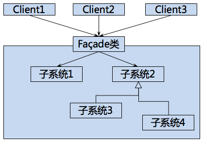
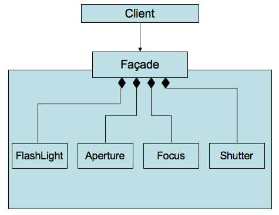

Facade Pattern
===

##1. 介绍

###1.1 针对问题

1. 系统复杂

    某个系统或者类过于复杂, 使用者需要详细了解内部结构才懂得使用.

###1.2 解决方法

1. UML图

    

###1.3 优点

1. 降低用户使用系统的难度

    用户不需要对系统内部有足够多的了解, 只需要简单地设置即可.

##2. 例子

###2.1 需求

1. 需求描述

    照相机需要设置闪光灯, 焦距, 光圈等参数才可以使用. 调节这些参数配合需要专业的知识, 设计一套方案使得调用者只要简单的设置就能够使用.
    
###2.2 方案

1. UML图

    

##3. 总结

##4. 附录

###4.1 例子代码:

1. python:

    Facade.py:
    
        # coding: utf-8
        """
            Example of  Facade pattern.
            @author: Liu Weijie
            @data: 2015-12-15
        
            需求:
                设计一个傻瓜相机, 只要选好拍照模式(白天模式或夜间模式), 即可自动完成各参数的设定.
        """
        
        
        class FlashLight(object):
            """ SubSystem1 """
        
            def __init__(self, is_open_in=False):
                self.is_open = is_open_in
        
            def open(self):
                self.is_open = True
        
            def close(self):
                self.is_open = False
        
        
        class Shutter(object):
            """ SubSystem2 """
        
            def action(self):
                print "action!"
        
        
        class Focus(object):
            """ SubSystem3 """
        
            def __init__(self, value_in=0):
                self.focue_value = value_in
        
            def set_focus_value(self, value):
                self.focue_value = value
        
        
        class Aperture(object):
            """ SubSystem4 """
        
            def __init__(self, value_in=0):
                self.aperture_value = value_in
        
            def set_aperture_value(self, value):
                self.aperture_value = value
        
        
        class Camera(object):
            """ Facade """
        
            def __init__(self):
                self.flash_light = FlashLight()
                self.shutter = Shutter()
                self.focus = Focus()
                self.aperture = Aperture()
        
            def set_day_mode(self):
                self.flash_light.close()
                self.focus.set_focus_value(10)
                self.aperture.set_aperture_value(10)
                print "set to day model successfuly!"
        
            def set_night_mode(self):
                self.flash_light.open()
                self.focus.set_focus_value(50)
                self.aperture.set_aperture_value(80)
                print "set to night model successfuly!"
        
            def action(self):
                self.shutter.action()
        
        
        if __name__ == "__main__":
            camera = Camera()
            camera.set_day_mode()
            camera.action()
            camera.set_night_mode()
            camera.action()

2. cpp

    main.cpp:
    
        /*
        Example of  Facade pattern.
        @author: Liu Weijie
        @data: 2015-12-15
    
        需求:
            设计一个傻瓜相机, 只要选好拍照模式(白天模式或夜间模式), 即可自动完成各参数的设定.
        */
        #include <iostream>
        
        // SubSystem1
        class FlashLight{
        public:
            FlashLight(bool is_open_in=false){
                is_open = is_open_in;
            }
        
            void open(){
                is_open = true;
            }
        
            void close(){
                is_open = false;
            }
        
        private:
            bool is_open;
        };
        
        // SubSystem2
        class Shutter{
        public:
            void action(){
                std::cout<<"action!\n";
            }
        };
        
        // SubSystem3
        class Focus{
        public:
            void set_focus_value(int value_in){
                focus_value = value_in;
            }
        
        private:
            int focus_value;
        };
        
        
        // SubSystem4
        class Aperture
        {
        public:
            Aperture(int value_in=0){
                aperture_value = value_in;
            };
            
            void set_aperture_value(int value_in){
                aperture_value =value_in;
            };
        
        private:
            int aperture_value;
        };
        
        // Facade
        class Camera{
        
        public:
            Camera(){
                std::cout<<"create a camera successfully!\n";
            }
        
            void set_day_mode(){
                flash_light->close();
                focus->set_focus_value(10);
                aperture->set_aperture_value(10);
                std:: cout<<"set to day mode!";
            }
        
            void set_night_mode(){
                flash_light->close();
                focus->set_focus_value(10);
                aperture->set_aperture_value(90);
                std:: cout<<"set to night mode!";
            }
        
            void action(){
                shutter->action();
            }
        
        private:
            FlashLight* flash_light = new FlashLight();
            Shutter* shutter = new Shutter();
            Focus* focus = new Focus();
            Aperture* aperture = new Aperture();
        
        };
        
        int main(int argc, const char * argv[]) {
            Camera* new_camera = new Camera();
            new_camera->set_day_mode();
            new_camera->action();
            new_camera->set_night_mode();
            return 0;
        }
        
        
        
        
        
        
        
        
        
        
        

