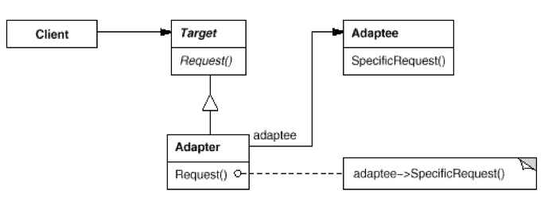
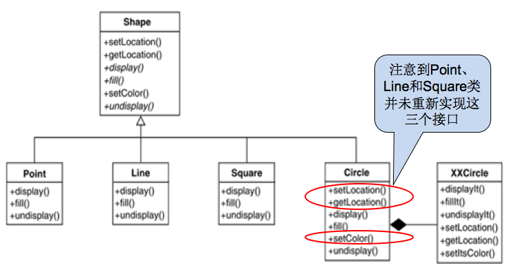
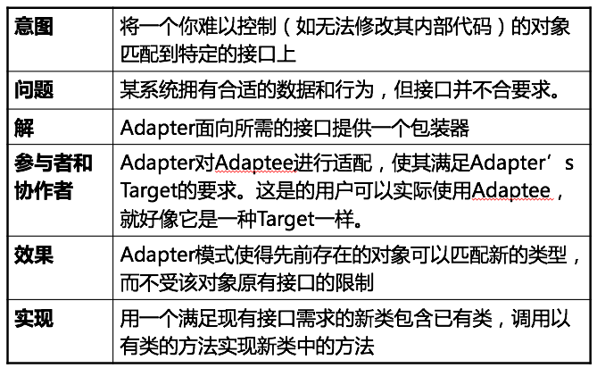

Adapter Pattern
===

##1. 介绍

###1.1 针对的问题

1. 接口无法使用

    有一些现成的类, 已经完成了我们需要的功能, 但是由于一些特殊的原因, 无法按照我们的意愿使用其接口.
    
    这个期望的接口, 通常我们无法修该.

###1.2 解决方法

1. Adapter

    将一个类的接口转换成客户希望的另一个接口, 就是在已有类上包装一层, 形成新的类, 这个新的类就是Adapter, 原本已有的类就是Adaptee.

2. UML图

    

###1.3 优点

1. 复用已有的设计

    Adapter模式使原来由于接口不兼容而不能一起工作的类可以一起工作. 使得不必重新设计, 还降低了工作量.

##2. 例子

###2.1 需求

1. 需求描述

    在Shape类的基础上, 需要一种新的形状——Circle:
    
        当然可以选择重新编写这个Circle类，并且使其实现Shape接口
        因为需要重新开发Circle的display、undisplay、fill函数，工作量比较大
        我们发现有一个别人编写的类可以满足我们的功能，但是这个类的接口不符合Shape类的要求

###2.2 方案

1. UML图

    

##3. 总结

##4. 附录:

###4.1 例子代码

1. python

    Adapter.py:
    
        # coding: utf-8
        """
            Example of Adapter pattern.
            @author: Liu Weijie
            @data: 2015-12-16
        
            需求:
                别人已经编写好一个XXCirecle类可以满足我们的需求, 但是这个类的接口不符合Shape类的要求.
        """
        
        
        class XXCircle:
            """ XX圆， 已有的类，相当于Adeptee """
        
            def display(self):
                print "I am XXCircle!\n"
        
        
        class Shape:
            """ 图形类的抽象接口 """
        
            def display(self):
                pass
        
        
        class Circle:
            """ 圆，相当于Adapter """
        
            def __init__(self):
                self.XX_circle = XXCircle()
        
            def display(self):
                self.XX_circle.display()
        
        
        if __name__ == "__main__":
            new_circle = Circle()
            new_circle.display()

2. cpp

    main.cpp:

        /*
            Example of Adapter pattern.
            @author: Liu Weijie
            @data: 2015-12-16
        
            需求:
                别人已经编写好一个XXCirecle类可以满足我们的需求, 但是这个类的接口不符合Shape类的要求.
        */
        #include <iostream>
        
        // XX圆，已有的类，相当于Adaptee
        class XXCircle{
        public:
            void display(){
                std::cout<< "I am circle!\n";
            }
        };
        
        // 图形类的接口
        class VirtualShape{
        public:
            virtual void display()=0;
        };
        
        // 圆形, 相当于Adapter
        class Circle:public VirtualShape{
        public:
            virtual void display(){
                xx_circle->display();
            }
        private:
            XXCircle* xx_circle = new XXCircle();
        };
        
        
        int main(int argc, const char * argv[]) {
            VirtualShape* new_circle = new Circle();
            new_circle->display();
            return 0;
        }

