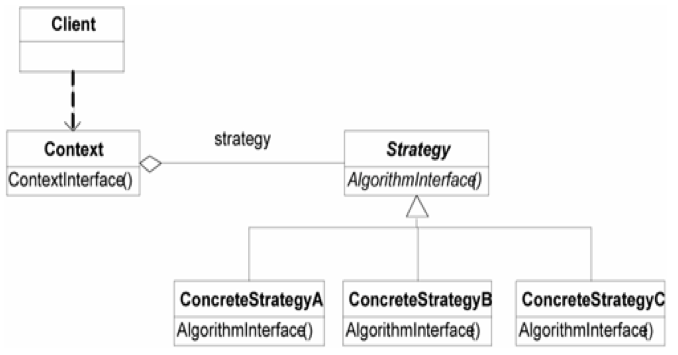
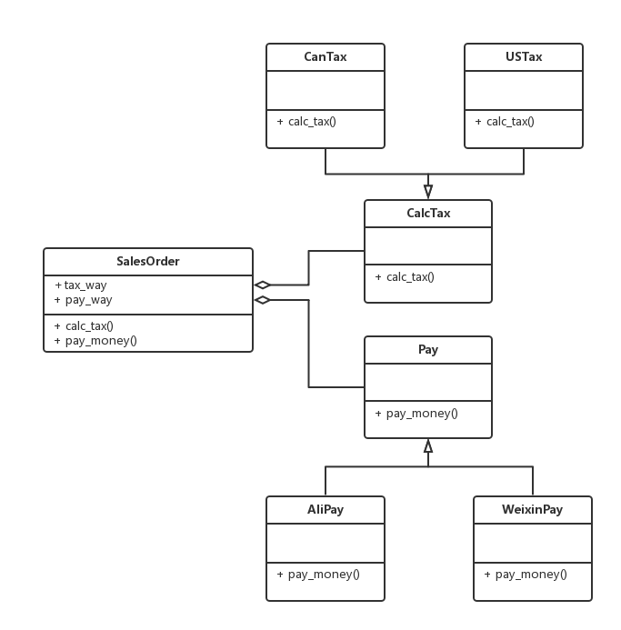
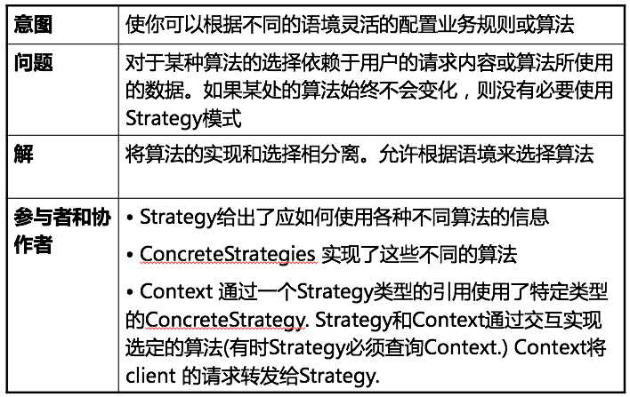
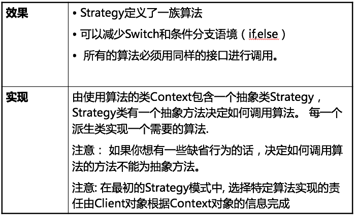

Strategy Pattern
===

##1. 介绍

###1.1 针对的问题

1. 多种策略组合

    在实际中我们经常会发现一个问题有多种可选的策略，这些策略在概念上具有相同的功能，但是适用于不同的环境
    
    如果我们简单的使用继承关系来对这些策略上的差异进行建模，可能会导致很多问题：

        类的个数迅速失控
        代码大量重复、冗余
        复用无法进行

###1.2 解决方法

1. Strategy

    将各种策略做一个各自抽象, 然后组合到具体的类中. 这样就可以在不同种策略中做组合.

2. UML图

    

###1.3 优点

1. 降低类的数量

    避免类的数量成倍增加.

2. 方便添加新的策略

    添加新的策略只需要派生出新的子类即可.

##2. 例子

###2.1 需求

1. 需求描述

    订单类有两种计税方案(美国税与加拿大税), 两种支付方案(微信支付与支付宝支付)

###2.2 方案

1. UML图

    

##3. 总结

##4. 附录:

###4.1 例子代码

1. python

    strategy.py:
    
        # coding: utf-8
        """
            Example of Strategy pattern.
            @author: Liu Weijie
            @data: 2015-12-17
        
            需求:
                设计一个订单类, 既可以计算美国税或加拿大税, 也可以用微信或者阿里支付.
        """
        
        
        class CalcTax(object):
            ''' Strategy1 '''
        
            def calc_tax(self):
                pass
        
        
        class USTax(CalcTax):
            ''' Strategy1_A '''
        
            def calc_tax(self):
                print "calc tax in US!\n"
        
        
        class CanTax(CalcTax):
            ''' Strategy1_B '''
        
            def calc_tax(self):
                print "calc tax in Canada!\n"
        
        
        class Pay(object):
            ''' Strategy2 '''
        
            def pay_money(self):
                pass
        
        
        class AliPay(Pay):
            ''' Strategy2_A '''
        
            def pay_money(self):
                print "pay in AliPay!\n"
        
        
        class WeixinPay(Pay):
            ''' Strategy2_B '''
        
            def pay_money(self):
                print "pay in WeixinPay!\n"
        
        
        class SalesOrder(object):
            ''' Context '''
        
            PAY_WAY = {
                "AliPay": AliPay(),
                "WeixinPay": WeixinPay(),
            }
        
            TAX_WAY = {
                'USTax': USTax(),
                'CanTax': CanTax(),
            }
        
            def __init__(self, pay_way_in="AliPay", tax_way_in="USTax"):
                self.pay_way = self.PAY_WAY[pay_way_in]
                self.tax_way = self.TAX_WAY[tax_way_in]
        
            def calc_tax(self):
                self.tax_way.calc_tax()
        
            def pay_money(self):
                self.pay_way.pay_money()
        
        
        if __name__ == "__main__":
            new_salesorder = SalesOrder(pay_way_in="AliPay", tax_way_in="CanTax")
            new_salesorder.calc_tax()
            new_salesorder.pay_money()

2. cpp

    main.cpp:

        /*
            Example of Strategy pattern.
            @author: Liu Weijie
            @data: 2015-12-17
        
            需求:
                设计一个订单类, 既可以计算美国税或加拿大税, 也可以用微信或者阿里支付.
        */
        #include <iostream>
        
        
        // Strategy1
        class CalcTax{
        public:
            virtual void calc_tax()=0;
        };
        
        
        // Strategy1_A
        class USTax: public CalcTax{
        public:
            virtual void calc_tax(){
                std::cout << "calculate tax in US!\n";
            }
        };
        
        
        // Strategy1_B
        class CanTax: public CalcTax{
        public:
            virtual void calc_tax(){
                std::cout << "calculate tax in Canada!\n";
            }
        };
        
        
        // Strategy2
        class Pay{
        public:
            virtual void pay_money()=0;
        };
        
        
        // Strategy2_A
        class AliPay: public Pay{
        public:
            virtual void pay_money(){
                std::cout << "pay money by AliPay\n";
            }
        };
        
        
        // Strategy2_B
        class WeixinPay: public Pay{
        public:
            virtual void pay_money(){
                std::cout << "pay money by WeixinPay\n";
            }
        };
        
        
        // Context
        class SalesOrder{
        private:
            CalcTax* calc_tax_way;
            Pay* pay_way;
        
        public:
            SalesOrder(CalcTax* calc_tax_in, Pay* pay_way_in){
                calc_tax_way = calc_tax_in;
                pay_way = pay_way_in;
            }
        
            void calc_tax(){
                calc_tax_way->calc_tax();
            }
        
            void pay_money(){
                pay_way->pay_money();
            }
        
        };
        
        int main(int argc, const char * argv[]) {
        
            SalesOrder* new_salesorder = new SalesOrder(new USTax(), new WeixinPay());
            new_salesorder->calc_tax();
            new_salesorder->pay_money();
            return 0;
        }

