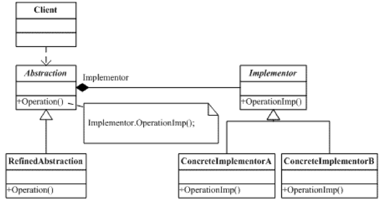
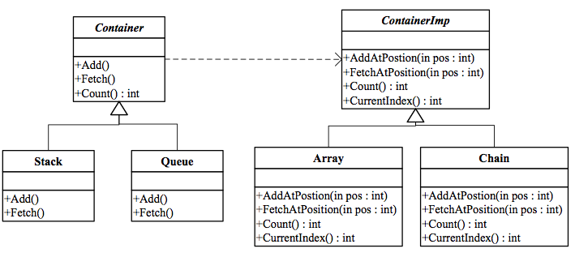
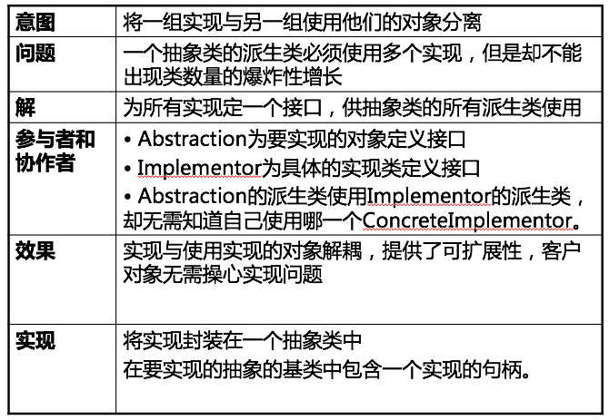

Bridge Pattern
===

##1. 介绍

###1.1 针对的问题

1. 一个抽象有多种实现

    要实现一个功能, 不同情况下调用的实现接口不一样. 
    
    笨的方法是针对不同情况各设计一个类, 这违背了"一个设计决策只实现一次"的思想.
    
###1.2 解决方法

1. Bridge

    将各自实现方法的接口抽象成一个统一的抽象接口, 功能实现只要调用这统一的接口接口. "依赖于抽象而不依赖于具体的实现"

2. UML图

    

###1.3 优点

1. 避免了重复设计

    如果对不同的环境都各设计一个类, 这里有重复的设计, 以后维护和修改都会很麻烦.

##2. 例子

###2.1 需求

1. 需求描述

    设计一组容器：容器包括堆栈、队列. 这些容器的实现可能是数组，也可能是链表;

###2.2 方案

1. UML图

    

##3. 总结

##4. 附录:

###4.1 例子代码

1. python

    bridge.py:
    
        # coding: utf-8
        """
            Example of Strategy pattern.
            @author: Liu Weijie
            @data: 2015-12-17
        
            需求:
                设计一组容器：容器包括堆栈、队列. 这些容器的实现可能是数组，也可能是链表;
        """
        
        class ContainerImp(object):
            ''' Implementor '''
        
            def add_at_position(self, char_in, position):
                pass
        
            def fetch_at_position(self, position):
                pass
        
        
        class Array(ContainerImp):
            ''' ConcreteImplementorA '''
        
            def add_at_position(self, chat_in, position):
                print "Add char_in at postion to Array successfuly!\n"
        
            def fetch_at_position(self, position):
                print "Fetch at postion to Array successfuly!\n"
        
        
        class Chain(ContainerImp):
            ''' ConcreteImplementorB '''
        
            def add_at_position(self, chat_in, position):
                print "Add char_in at postion to Array successfuly!\n"
        
            def fetch_at_position(self, position):
                print "Fetch at postion to Array successfuly!\n"
        
        
        class Container(object):
            ''' Abstraction '''
        
            CONTAINER_IMP_LIST = {
                'Array': Array(),
                'Chain': Chain(),
            }
        
            def __init__(self, container_imp_in="Array"):
                self._container_imp = self.CONTAINER_IMP_LIST[container_imp_in]
        
            def add(self, char_in):
                pass
        
            def fetch(self):
                pass
        
        
        class Stack(Container):
            ''' ConcreteAbstractionA '''
        
            def __init__(self, container_imp_in="Array"):
                super(Stack, self).__init__(container_imp_in)
                self._position = 0
        
            def add(self, char_in):
                self._container_imp.add_at_position(char_in, self._position)
                self._position += 1
        
            def fetch(self):
                self._container_imp.fetch_at_position(self._position)
                self._position -= 1
        
        
        class Queue(Container):
            ''' ConcreteAbstractionB '''
        
            def __init__(self, container_imp_in="Array"):
                super(Queue, self).__init__(container_imp_in)
                self._position_head = 0
                self._position_tail = 0
        
            def add(self, char_in):
                self._position_head += 1
                self._container_imp.add_at_position(char_in, self._position_head)
        
            def fetch(self):
                self._container_imp.fetch_at_position(self._position_tail)
                self._position_tail -= 1
        
        
        if __name__ == "__main__":
            new_stack = Stack(container_imp_in="Chain")
            new_stack.add('o')
            new_stack.fetch()
            new_queue = Queue(container_imp_in="Array")
            new_queue.add('o')
            new_queue.fetch()

2. cpp

    main.cpp:
    
    
         /*
            For bridge pattern.
            @author: Liu Weijie
            @date: 2015-12-16
        
            需求：
                设计一组容器：
                    这些容器可能是数组，也可能是链表
                    容器包括堆栈、队列
        */
        #include <iostream>
        
        
        // Implementor
        class ContainerImp{
        
        public:
        
            virtual void add_at_postion(char char_in, int postion)=0;
        
            virtual void fetch_at_postion(int postion)=0;
        };
        
        
        // ConcreteImplementorA
        class Array: public ContainerImp{
        
        public:
        
            void add_at_postion(char char_in, int postion){
                std:: cout<<"Add char_in at postion to Array successfuly!\n";
            }
        
            void fetch_at_postion(int postion){
                std:: cout<<"Fetch at postion to Array successfuly!\n";
            }
        };
        
        
        // ConcreteImplementorB
        class Chain: public ContainerImp{
        
        public:
        
            void add_at_postion(char char_in, int postion){
                std:: cout<<"Add char_in at postion to Chain successfuly!\n";
            }
        
            void fetch_at_postion(int postion){
                std:: cout<<"Fetch at postion to Chain successfuly!\n";
            }
        };
        
        
        // Abstraction
        class Container{
        
        public:
        
            virtual void add(char char_in)=0;
        
            virtual void fetch()=0;
        
            void set_implement(ContainerImp* implment_in){
                _implement = implment_in;
            }
        
            ContainerImp* get_implement(){
                return _implement;
            }
        
        private:
        
            ContainerImp* _implement;
        };
        
        
        // ConcreteAbstractionA
        class Stack: public Container{
        
        public:
        
            Stack(ContainerImp* implment_in){
                set_implement(implment_in);
                _position = 0;
            }
        
            void add(char char_in){
                _position++;
                get_implement()->add_at_postion(char_in, _position);
            }
        
            void fetch(){
                get_implement()->fetch_at_postion(_position);
                _position--;
            }
        
        private:
        
            int _position = 0;
        };
        
        
        // ConcreteAbstractionB
        class Queue: public Container{
        
        public:
        
            Queue(ContainerImp* implment_in){
                set_implement(implment_in);
                _position_head = 0;
                _position_tail = 0;
            }
        
            void add(char char_in){
                _position_head++;
                get_implement()->add_at_postion(char_in, _position_head);
            }
        
            void fetch(){
                get_implement()->fetch_at_postion(_position_tail);
                _position_tail--;
            }
        
        private:
        
            int _position_head = 0;
            int _position_tail = 0;
        };
        
        
        int main(){
            ContainerImp* new_imp = new Array();
            Container* new_stack = new Stack(new_imp);
            new_stack->add('o');
            new_stack->fetch();
            return 0;
        }
        

