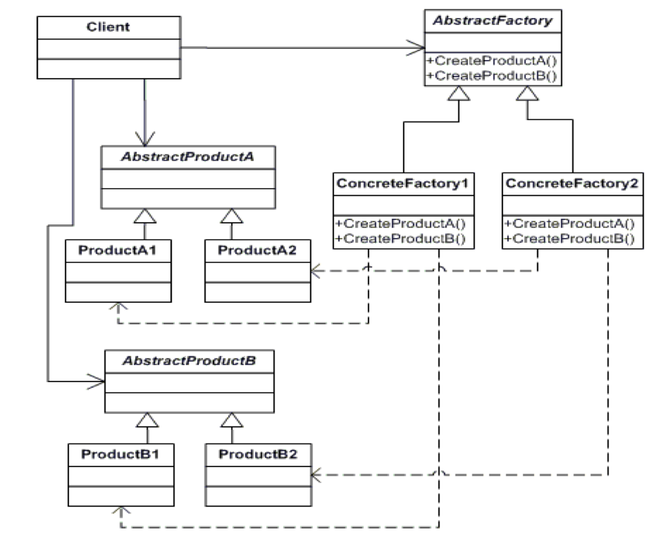
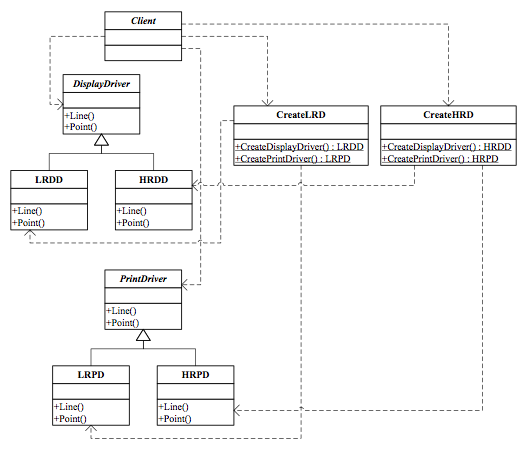
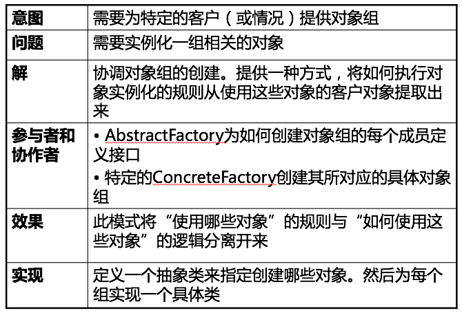

Abstract Factory Pattern
===

##1. 介绍

###1.1 针对的问题

1. 对象的创建与使用混乱

    创建对象时直接调用该类, 这样是不好的.

2. 固定搭配

    几种对象之间有固定的搭配, 不能出现混乱.

###1.2 解决方法

1. Abstract Factory

    设计一个抽象的工厂, 要创建对象时用这些工厂里的create方法创建, 而不是直接调用该类.
    
    一个工厂固定只能创建某些对象的组合, 防止出现不符合逻辑的搭配.

2. UML图

    

###1.3 优点

1. 创建与调用分离

    规范了调用者的使用.

2. 避免出现搭配错误

    抽象工厂固定了该有的搭配.

##2. 例子

###2.1 需求

1. 需求描述

    设计一个打印机对象, 高级现实驱动必须配合高级打印驱动, 低级显示驱动必须配合低级打印驱动, 不能混乱.

###2.2 方案

1. UML图

    

##3. 总结

##4. 附录:

###4.1 例子代码

1. python

    abstract_factory.py:
    
        # coding: utf-8
        """
            Example of  Abstract Factory pattern.
            @author: Liu Weijie
            @data: 2015-12-19
        
            需求:
                高级显示驱动配高级打印驱动.
                低级显示驱动配低级打印驱动.
        """
        
        
        class DisplayDriver(object):
            """ AbstractProductA """
        
            def line(self):
                pass
        
            def point(self):
                pass
        
        
        class LRDD(DisplayDriver):
            """ ProductA1 低级产品 """
        
            def line(self):
                print "I am LRDD line()!\n"
        
            def point(self):
                print "I am LRDD point()!\n"
        
        
        class HRDD(DisplayDriver):
            """ ProductA2 高级产品 """
        
            def line(self):
                print "I am HRDD line()!\n"
        
            def point(self):
                print "I am HRDD point()!\n"
        
        
        class PrintDriver(object):
            """ AbstractProductB """
        
            def line(self):
                pass
        
            def point(self):
                pass
        
        
        class LRPD(PrintDriver):
            """ ProductB1 低级产品 """
        
            def line(self):
                print "I am LRPD line()!\n"
        
            def point(self):
                print "I am LRPD point()!\n"
        
        
        class HRPD(PrintDriver):
            """ ProductB2 高级产品 """
        
            def line(self):
                print "I am HRPD line()!\n"
        
            def point(self):
                print "I am HRPD point()!\n"
        
        
        class CreateRD(object):
            """ AbstractFactory """
        
            def create_display_driver(self):
                pass
        
            def create_print_driver(self):
                pass
        
        
        class CreateLRD(CreateRD):
            """ ConcreteFactory1 生产低级产品 """
        
            def create_display_driver(self):
                return LRDD()
        
            def create_print_driver(self):
                return LRPD()
        
        
        class CreateHRD(CreateRD):
            """ ConcreteFactory2 """
        
            def create_display_driver(self):
                return HRDD()
        
            def create_print_driver(self):
                return HRPD()
        
        if __name__ == "__main__":
            new_factory = CreateHRD()
            new_DD = new_factory.create_display_driver()
            new_DD.line()
            new_PD = new_factory.create_print_driver()
            new_PD.point()

2. cpp

    main.cpp:

        /*
            Example of  Abstract Factory pattern.
            @author: Liu Weijie
            @data: 2015-12-19
        
            需求:
                高级显示驱动配高级打印驱动.
                低级显示驱动配低级打印驱动.
        */
        #include <iostream>
        
        
        // AbstractProductA
        class DisplayDriver{
        
        public:
        
            virtual void line()=0;
        
            virtual void point()=0;
        };
        
        
        // ProductA1 低级产品
        class LRDD: public DisplayDriver{
        
        public:
        
            virtual void line(){
                std::cout << "I am LRDD line()!\n";
            }
        
            virtual void point(){
                std::cout << "I am LRDD point()!\n";
            }
        };
        
        
        // ProductA2 高级产品
        class HRDD: public DisplayDriver{
        
        public:
        
            virtual void line(){
                std::cout << "I am HRDD line()!\n";
            }
        
            virtual void point(){
                std::cout << "I am HRDD point()!\n";
            }
        };
        
        
        // AbstractProductB
        class PrintDriver{
        
        public:
        
            virtual void line()=0;
        
            virtual void point()=0;
        };
        
        
        // ProductB1 低级产品
        class LRPD: public PrintDriver{
        
        public:
        
            virtual void line(){
                std::cout << "I am LRPD line()!\n";
            }
        
            virtual void point(){
                std::cout << "I am LRPD point()!\n";
            }
        };
        
        
        // ProductB2 高级产品
        class HRPD: public PrintDriver{
        
        public:
        
            virtual void line(){
                std::cout << "I am HRPD line()!\n";
            }
        
            virtual void point(){
                std::cout << "I am HRPD point()!\n";
            }
        };
        
        
        // AbstractFactory
        class CreateRD{
        
        public:
        
            virtual DisplayDriver* create_display_driver()=0;
        
            virtual PrintDriver* create_print_driver()=0;
        };
        
        
        // ConcreteFactory1 生产低级产品
        class CreateLRD: public CreateRD{
        
        public:
        
            virtual DisplayDriver* create_display_driver(){
                return new LRDD();
            }
        
            virtual PrintDriver* create_print_driver(){
                return new LRPD();
            }
        };
        
        
        // ConcreteFactory2 生产高级产品
        class CreateHRD: public CreateRD{
        
        public:
        
            virtual DisplayDriver* create_display_driver(){
                return new HRDD();
            }
        
            virtual PrintDriver* create_print_driver(){
                return new HRPD();
            }
        };
        
        
        int main(){
            CreateRD* new_factory = new CreateHRD();
            DisplayDriver* new_DD = new_factory->create_display_driver();
            new_DD->line();
            PrintDriver* new_PD = new_factory->create_print_driver();
            new_PD->point();
            return 0;
        }

