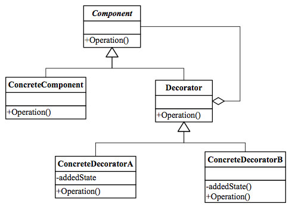
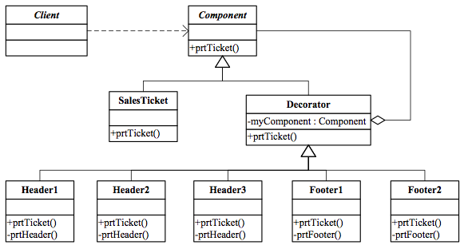
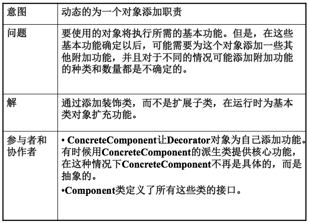
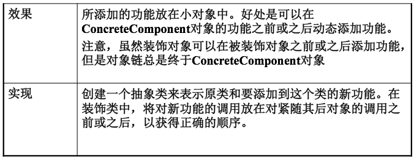

Decorator Pattern
===

##1. 介绍

###1.1 针对的问题

1. 在程序允许中改变一个类

    一个已有的类的某些特性需要在程序运行过程中才能决定.

2. 属性或方法的组合

    某些类要有一些方法和属性的组合.

###1.2 解决方法

1. Decorator

    用装饰器可以改变一个类的属性或方法, 也可以给一个类添加方法或属性.
    
    给一个类的对象作用多个装饰器, 可以实现各种属性或方法的组合.

2. UML图

    

###1.3 优点

1. 运行时改变类的特性

    在运行时决定类的特性.

2. 属性或方法组合

    可以实现多种方法或属性的组合. 没有组合数量的限制.

##2. 例子

###2.1 需求

1. 需求描述

    有一个程序打印发票，所有发票都需要有正文 部分，同时根据用户需要有的订单需要有表头，有的需要有页脚。表头有3种，分别叫做“表头1”、 “表头2”、 “表头3”；页脚有2种，分别叫做“页脚1”、“页脚2”。不同的用户可能要求有表头，没有表头；有1种表头，或者同时有2个表头，或者3个表头；有页脚，没有页脚；有1个页脚，或者2个不同的页脚。

###2.2 方案

1. UML图

    

##3. 总结

##4. 附录:

###4.1 例子代码

1. python

    decorator.py:
    
        # coding: utf-8
        """
            Example of  Decorator pattern.
            @author: Liu Weijie
            @data: 2015-12-19
        
            需求:
                设计一个给发票对象添加新功能的装饰器:
                    所有发票都有打印正文的功能, 但是有些发票有表头或页脚.
        """
        
        
        class Component(object):
            """ VirtualComponent """
        
            def print_ticket(self):
                pass
        
        
        class SalesTicket(Component):
            """ ConcreteComponet """
        
            def __init__(self, body_content_in):
                self.body_content = body_content_in
        
            def print_ticket(self):
                print "Content:\n", self.body_content
        
        
        class SalesTicketDecorator(Component):
            """ Decorator """
        
            def __init__(self, sales_ticket_in):
                self.sales_ticket = sales_ticket_in
        
            def print_ticket(self):
                self.sales_ticket.print_ticket()
        
        
        class AddHeader(SalesTicketDecorator):
            """ ConcreteDecoratorA """
        
            def __init__(self, sales_ticket_in, header_content_in):
                super(AddHeader, self).__init__(sales_ticket_in)
                self.header_content = header_content_in
        
            def print_header(self):
                print "Header:\n", self.header_content
        
            def print_ticket(self):
                self.print_header()
                self.sales_ticket.print_ticket()
        
        
        class AddFooter(SalesTicketDecorator):
            """ ConcreteDecoratorB """
        
            def __init__(self, sales_ticket_in, footer_content_in):
                super(AddFooter, self).__init__(sales_ticket_in)
                self.footer_content = footer_content_in
        
            def print_footer(self):
                print "Footer:\n", self.footer_content
        
            def print_ticket(self):
                self.sales_ticket.print_ticket()
                self.print_footer()
        
        
        if __name__ == "__main__":
            # init sales ticket
            print "--------------init sales ticket--------------------"
            new_sales_ticket = SalesTicket("I am body!")
            new_sales_ticket.print_ticket()
            print "---------------------------------------------------"
        
            print "------------sales ticket with header---------------"
            ST_with_header = AddHeader(new_sales_ticket, "I am header!")
            ST_with_header.print_ticket()
            print "---------------------------------------------------"
        
            print "-------sales ticket with header and footer---------"
            ST_with_header_and_footer = AddFooter(ST_with_header, "I am footer!")
            ST_with_header_and_footer.print_ticket()
            print "---------------------------------------------------"

2. cpp

    main.cpp:

        /*
            Example of  Decorator pattern.
            @author: Liu Weijie
            @data: 2015-12-19
        
            需求:
                设计一个给发票对象添加新功能的装饰器:
                    所有发票都有打印正文的功能, 但是有些发票有表头或页脚.
        */
        #include <iostream>
        
        
        // VirtualComponent
        class Component{
        
        public:
        
            virtual void print_ticket()=0;
        };
        
        
        // ConcreteComponent
        class SalesTicket: public Component{
        
        public:
        
            SalesTicket(char* body_content_in){
                _body_content = body_content_in;
            }
        
            virtual void print_ticket(){
                std::cout << "Content:\n"<<_body_content<<"\n";
        
            }
        
        private:
        
            char* _body_content;
        };
        
        
        // Decorator
        class SalesTicketDecorator: public Component{
        
        public:
        
            SalesTicketDecorator(Component* sales_ticket_in){
                _sales_ticket = sales_ticket_in;
            }
        
            virtual void print_ticket(){
                _sales_ticket->print_ticket();
            }
        
            virtual void set_sales_ticket(Component* sales_ticket_in){
                _sales_ticket = sales_ticket_in;
            }
        
            virtual Component* get_sales_ticket(){
                return _sales_ticket;
            }
        
        private:
        
            Component* _sales_ticket;
        
        };
        
        
        // ConcreteDecoratorA
        class AddHeader: public SalesTicketDecorator{
        
        public:
        
            AddHeader(Component* sales_ticket_in, char* header_content_in): SalesTicketDecorator(sales_ticket_in){
                _header_content = header_content_in;
            };
        
            virtual void print_ticket(){
                _print_header();
                get_sales_ticket()->print_ticket();
            }
        
        private:
        
            char* _header_content;
        
            virtual void _print_header(){
                std::cout << "Header:\n"<<_header_content<<"\n";
            }
        };
        
        
        // ConcreteDecoratorB
        class AddFooter: public SalesTicketDecorator{
        
        public:
        
            AddFooter(Component* sales_ticket_in, char* footer_content_in): SalesTicketDecorator(sales_ticket_in){
                _footer_content = footer_content_in;
            }
        
            virtual void print_ticket(){
                get_sales_ticket()->print_ticket();
                _print_footer_content();
            }
        private:
        
            char* _footer_content;
        
            virtual void _print_footer_content(){
                std::cout << "Footer:\n"<<_footer_content<<"\n";
            }
        };
        
        
        int main(){
            // init sales ticket
            std::cout << "init sales ticket:"<<"\n"<<"--------------------"<<"\n";
            Component* new_sales_ticket = new SalesTicket("here is body...");
            new_sales_ticket->print_ticket();
            std::cout << "--------------------"<<"\n"<<"\n";
        
            // sales ticket with header
            std::cout << "sales ticket with header:"<<"\n"<<"--------------------"<<"\n";
            Component* ST_with_header = new AddHeader(new_sales_ticket, "here is header...");
            ST_with_header->print_ticket();
            std::cout << "--------------------"<<"\n"<<"\n";
        
            // sales ticket with footer
            std::cout << "sales ticket with header and footer:"<<"\n"<<"--------------------"<<"\n";
            Component* ST_with_header_and_footer = new AddFooter(ST_with_header, "here is footer...");
            ST_with_header_and_footer->print_ticket();
            std::cout << "--------------------"<<"\n"<<"\n";
            return 0;
        }

