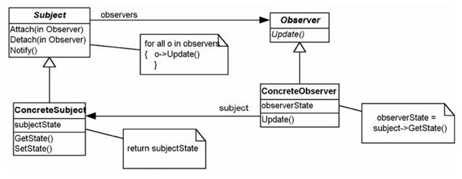
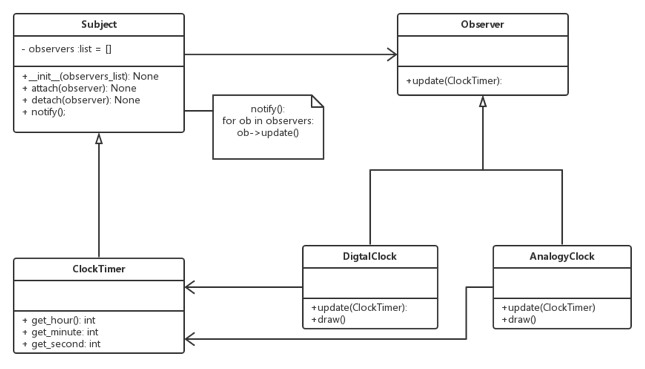

Observer Pattern
===

##1. 介绍

###1.1 针对的问题

1. 相同内容多种展示形式

    一个内容, 可以有多种展示形式. 例如某各数据, 既可以用表格, 也可以用柱状图,饼状图来展示. 如何保证内容与展示统一, 且即时更新.

###1.2 解决方法

1. Observer

    将内容与展示分开, 一旦内容有改变, 就通知展示回来取内容并重新刷新.

2. UML图

    

###1.3 优点

1. 内容与展示分隔开

    将内容与展示分隔开, 保证了各个展示的内容统一.

2. 即时更新

    内容一旦改变, 各展示形式都可以即时更新.

##2. 例子

###2.1 需求

1. 需求描述

    系统内有一个计时器（模型，没有界面），这个计时器驱动两个形式的时钟界面，一个数字时钟，一个模拟时钟.

###2.2 方案

1. UML图

    

##3. 总结

将内容与展示的形式分割开, 单独设计. 内容一旦改变就通知展示重新取内容并更新. 展示形式像是一个观测者, 观察内容的变动.

##4. 附录:

###4.1 例子代码

1. python

    observer.py:
    
        # coding: utf-8
        """
            Example of  Observer pattern.
            @author: Liu Weijie
            @data: 2015-12-25
        
            需求:
                系统内有一个计时器（模型，没有界面），这个计时器驱动两个形式的时钟界面，一个数字时钟，一个模拟时钟.
        """
        
        
        class Subject(object):
            """ Subject """
        
            def __init__(self):
                self.observers = []
        
            def attach(self, observer_add):
                self.observers.append(observer_add)
        
            def detach(self, observer_del):
                self.observers.remove(observer_del)
        
            def notify(self):
                for ob in self.observers:
                    ob.update(self)
        
        
        class Observer(object):
            """ Observer """
        
            def __init__(self):
                pass
        
            def update(self, subject):
                pass
        
        
        class ClockTimer(Subject):
            """ ConcreteSubject """
        
            def __init__(self, hour_in, minute_in, second_in):
                super(ClockTimer, self).__init__()
                self._hour = hour_in
                self._minute = minute_in
                self._second = second_in
        
            def get_hour(self):
                return self._hour
        
            def set_hour(self, hour_in):
                self._hour = hour_in
        
            def get_minute(self):
                return self._minute
        
            def set_minutr(self, minute_in):
                self._minute = minute_in
        
            def get_second(self):
                return self._second
        
            def set_second(self, second_in):
                self._second = second_in
        
        
        class DigtalClock(Observer):
            """ ConcreteObserver """
        
            def __init__(self, subject):
                self._hour = subject.get_hour()
                self._minute = subject.get_minute()
                self._second = subject.get_second()
        
            def update(self, subject):
                self._hour = subject.get_hour()
                self._minute = subject.get_minute()
                self._second = subject.get_second()
        
            def draw(self):
                print "DigtalClock:", self._hour, ":", self._minute, ":", self._second, "\n"
        
        
        class AnalogyClock(Observer):
            """ ConcreteObserver """
        
            def __init__(self, subject):
                self._hour = subject.get_hour()
                self._minute = subject.get_minute()
                self._second = subject.get_second()
        
            def update(self, subpreject):
                self._hour = subject.get_hour()
                self._minute = subject.get_minute()
                self._second = subject.get_second()
        
            def draw(self):
                print "Analogylock:", self._hour, ":", self._minute, ":", self._second, "\n"
        
        
        if __name__ == "__main__":
            # init
            clock_timer = ClockTimer(6, 0, 0)
            digtal_clock = DigtalClock(clock_timer)
            analogy_clock = AnalogyClock(clock_timer)
            clock_timer.attach(digtal_clock)
            clock_timer.attach(analogy_clock)
            digtal_clock.draw()
            analogy_clock.draw()
        
            # an hour later
            clock_timer.set_hour(7)
            clock_timer.notify()
            digtal_clock.draw()
            analogy_clock.draw()
        
            # an hour later
            clock_timer.detach(analogy_clock)
            clock_timer.set_hour(8)
            clock_timer.notify()
            digtal_clock.draw()
            analogy_clock.draw()
