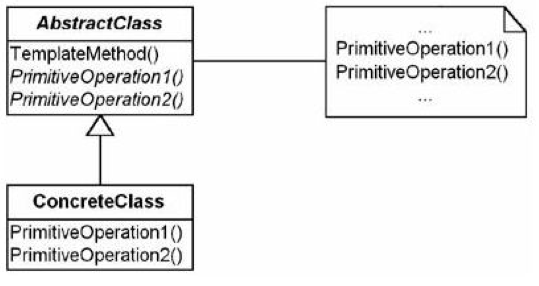
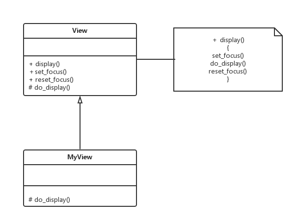
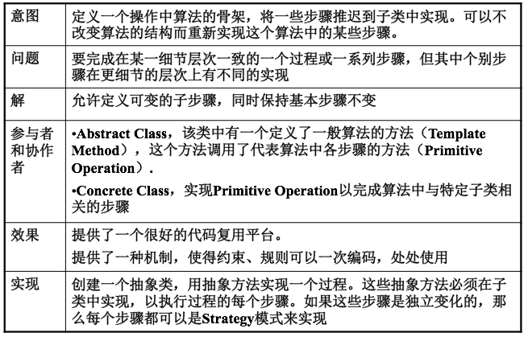

Decorator Pattern
===

##1. 介绍

###1.1 针对的问题

1. 不同程序员间随意设计

    某个功能需要应对不同情况进行多个实现, 但是不同的程序员设计会导致每个情况程序设计的风格差很多, 还很不规范.
    
2. 重复设计严重

    有些设计在不同场合是可以复用的, 程序员只要重写那些无法复用的部分即可.

###1.2 解决方法

1. Template Method

    制作一个模版, 不同情况的设计都按照统一的模版来写. 可以复用的部分就不用写. 
    
    只要重写一个个功能模块就可以, 程序执行时按一定顺序调用各个功能模块.

2. UML图

    

###1.3 优点

1. 规程程序

    使得程序编写更加规范, 不易出错.

2. 模块化设计

    使得各个部分的设计分割更加清楚, 实现模块化设计.

3. 代码复用

    不必重写的部分可以复用.

##2. 例子

###2.1 需求

1. 需求描述

    一个支持在屏幕上绘图的类View。一个view获得焦点之后才能设置特定的图形设备环境（如颜色、字体等），因而只有获得焦点后才能绘图。

    这是一个约束（或者规则），如何编码这一约束，使得这一约束能够很容易的被遵守.

###2.2 方案

1. UML图

    

##3. 总结

##4. 附录:

###4.1 例子代码

1. python

    template_method.py:
    
        # coding: utf-8
        """
            Example of  Template Method pattern.
            @author: Liu Weijie
            @data: 2016-01-03
        
            需求:
                一个支持在屏幕上绘图的类View。一个view获得焦点之后才能设置特定的图形设备环境（如颜色、字体等），因而只有获得焦点后才能绘图。
        """
        
        
        class View(object):
            """ AbstractTemplate """
        
            def set_focus(self):
                print "this is set_focus()!"
        
            def reset_focus(self):
                print "this is reset_focus()!"
        
            def do_display(self):
                print "this is do_display()!"
        
            def display(self):
                self.set_focus()
                self.do_display()
                self.reset_focus()
        
        
        class MyView(View):
            """ ConcreteTemplate """
        
            def do_display(self):
                """
                    Write your display code here.
                """
                print "this is my display code!"
        
        
        if __name__ == "__main__":
            my_view = MyView()
            my_view.display()

2. cpp

    main.cpp:

        /*
            Example of  Template Method pattern.
            @author: Liu Weijie
            @data: 2016-01-03
        
            需求:
                一个支持在屏幕上绘图的类View。一个view获得焦点之后才能设置特定的图形设备环境（如颜色、字体等），因而只有获得焦点后才能绘图。
        */
        #include <iostream>
        
        
        using namespace std;
        
        
        // AbstractTemplate
        class View{
        
        public:
        
            virtual void set_focus(void){
                cout << "this is set_focus()!" << endl;
            }
        
            virtual void reset_focus(void){
                cout << "this is reset_focus()!" << endl;
            }
        
            virtual void do_display(void){
                cout << "this do_display()!" << endl;
            }
        
            virtual void display(void){
                set_focus();
                do_display();
                reset_focus();
            }
        };
        
        
        class MyView: public View{
        
        protected:
        
            virtual void do_display(void){
                cout<< "this is my display code!" << endl;
            }
        };
        
        int main(){
            View* my_view = new MyView();
            my_view->display();
            return 0;
        }
